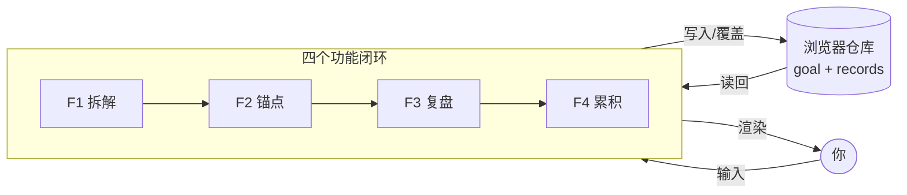

# TECH_DESIGN.md｜锚点：技术设计

> 项目：Vibe coding（锚点）· Day 5 产出
> 作者：Victor（AI 协助整理）
> 本文档回答：数据从哪来、到哪去；用什么技术实现；为什么这么选。
> 上游文档：research.md（需求研究）· PRD.md（产品需求文档）
> 下游：Day 6 起的实际编码

---

## 一、一句话技术路线

**一个纯静态网页：没有后端、没有数据库，所有数据存在浏览器自带的仓库里（localStorage），用 GitHub Pages 托管。**

用户打开网页 → 页面和逻辑全在浏览器里跑 → 数据读写只发生在这一台设备的浏览器里。

---

## 二、技术选型与理由

| 层 | 选型 | 一句话理由 |
|---|---|---|
| 前端 | 原生 HTML + CSS + JavaScript（无框架、无构建） | 5 个页面、4 个功能、1 个用户——这个规模用不上框架 |
| 后端 | 本期没有 | 单用户、单设备、数据不共享（见 2.1） |
| 数据库 | 本期没有，用浏览器 localStorage 代替 | 同上 |
| 构建工具 | 不用（不装 Node、不打包） | 少一层工具，就少一处能卡住自己的地方 |
| 托管 | GitHub Pages | 仓库已存在，推送即上线，自带 HTTPS |
| 代码托管 | GitHub（gin996hhh/vibe-coding） | Day 3 起已在用 |

### 2.1 为什么不上后端和数据库

后端的核心职责是**当门卫**：守住数据，只让有权限的人读写。数据库的核心价值是**让数据能跨设备、跨用户**。

锚点 MVP 这三条同时成立：

- 只有一个用户（作者本人）
- 只用一台设备
- 数据不需要给别人看

这三条一成立，"后端 + 数据库"就只剩下成本：买服务器、写接口、做登录、维护域名——换不来 MVP 需要的任何一项能力。

**但要说清一件事：没有后端 ≠ 没有逻辑。** 拆解规则、体检评分、曲线计算，全部在前端跑。因为数据就住在浏览器里，读它不需要经过网络。

### 2.2 为什么不用前端框架（React / Vue）

框架解决的是"页面很多、状态很乱、多人协作"的问题。当前规模是：

- 5 个视图
- 4 个功能
- 1 个人写

用框架要多付三笔成本：装 Node 环境、学 JSX / 模板语法、理解构建链。收益要等功能数上十几个、开始多人协作才出现。

**结论**：MVP 阶段用原生 JS——把逻辑写清楚，比把工程搞专业更重要。将来真要换框架，业务逻辑是纯 JS，可以搬过去。

### 2.3 为什么部署在 GitHub Pages

- 仓库已经存在（Day 3 起的文档都推在这儿），不用新开账号
- **推送即上线**：`push` 完约 1 分钟，`https://gin996hhh.github.io/vibe-coding/` 就能打开
- 免费、自带 HTTPS
- 不需要服务器运维

### 2.4 为什么用 localStorage

- 浏览器自带：零安装、零配置、零费用
- 容量约 5 MB——锚点存的是文字和整数，一天一条不到 1 KB，够用很久
- 读写简单：一行存、一行取

**代价**（PRD 第七章已记录）：换设备 / 换浏览器 / 清缓存 → 数据会丢；手机看不到电脑上的记录。这是 MVP 阶段明确接受的取舍。

---

## 三、文件结构

```
vibe-coding/                    ← 仓库根（GitHub Pages 从这里发布）
├── index.html                  ← F1 首页：输入目标
├── decompose.html              ← F1 三环展示
├── today.html                  ← F2 每日锚点（含最小体检）
├── reflect.html                ← F3 复盘卡
├── growth.html                 ← F4 累积视图
├── css/
│   └── style.css               ← 全站样式，五个页面共用
├── js/
│   ├── store.js                ← 数据层：所有读写 localStorage 的代码只在这一个文件
│   ├── decompose.js            ← 拆解规则
│   ├── today.js                ← 体检 + 锚点生成 + 勾选
│   ├── reflect.js              ← 复盘卡保存
│   └── growth.js               ← 统计与画图
├── research.md                 ← Day 3
├── PRD.md                      ← Day 4
├── TECH_DESIGN.md              ← 本文档（Day 5）
└── AGENTS.md                   ← Day 1
```

**一个刻意的设计**：读写数据的代码全部集中在 `js/store.js`。将来 Day 15 换成云端数据库时，只改这一个文件，另外 5 个页面一行都不用动。

---

## 四、数据存什么、存在哪

localStorage 只有"键 → 值"一种结构，值必须是字符串，所以对象要先转成 JSON 字符串再存。

| 键 | 存什么 | 结构 |
|---|---|---|
| `anchor.goal` | 当前目标（只有一个） | JSON 对象 |
| `anchor.records` | 每日记录（一天一条，可追加） | JSON 数组 |

### anchor.goal

```json
{
  "id": "g_1726822800000",
  "content": "半年内英文口语能上台",
  "created_at": "2026-09-20",
  "status": "active",
  "three_rings": {
    "state":     { "text": "先把睡眠稳住，精力才有底", "adjustable": "今晚 23:30 前睡" },
    "frequency": { "text": "每天做 1 次，不求多",       "adjustable": "从每天 1 次开始，稳了再加" },
    "method":    { "text": "方法自己找，只挑一个今天能做的", "adjustable": "把 30 分钟跟读缩小成 3 句" }
  }
}
```

### anchor.records

```json
[
  {
    "date": "2026-09-20",
    "checkin": { "sleep": 3, "energy": 2, "mood": 3 },
    "morning_done": true,
    "evening_done": false,
    "state_score": 3,
    "method_text": "跟读了 3 句，没卡壳",
    "stuck_text": "不是不想读，是词太生，读第二句就卡住了",
    "hard_start_text": "不想开口，还是先开了口"
  }
]
```

**写入规则**

- 同一天再写 → 覆盖当天那一条，不新增（对应 PRD 第七章"可改可存"）
- 读取时键不存在 → 返回空结构，不报错
- `date` 用本地日期 `YYYY-MM-DD`，一天最多一条

> **与 PRD 的一处对齐说明**：PRD 第六章的 `daily_record` 字段表里没有体检三项（睡眠 / 精力 / 情绪），但 F2 写明了要"各 1–5 格"。这里补齐为 `checkin` 字段——属实现层细化，不改动 PRD 的任何结论。

---

## 五、数据流图

> 今天要掌握的那句话先给答案：**数据从你的手来，到浏览器自带的仓库去，全程不经过任何服务器。**

### 5.1 一图全貌

```text
        ┌─────┐
        │ 你  │
        └──┬──┘
           │ 输入目标 / 点勾选 / 填量表
           ▼
  ┌──────────────────────────┐
  │  四个功能闭环              │
  │  F1 拆解 → F2 锚点        │
  │             → F3 复盘     │
  │             → F4 累积     │
  └────────────┬─────────────┘
               │ 写入 / 覆盖
               ▼
  ┌──────────────────────────┐
  │  浏览器仓库               │
  │  • anchor.goal   (1 条)  │
  │  • anchor.records (N 条) │
  └────────────┬─────────────┘
               │ 读回来
               ▼
           ┌─────┐
           │ 你  │（看见仪式清单 / 状态曲线 / 前后对比）
           └─────┘
```

### 5.2 各功能读写什么

| 功能 | 页面 | 写什么 | 读什么 |
|---|---|---|---|
| F1 | `index.html` → `decompose.html` | `anchor.goal` | — |
| F2 | `today.html` | `anchor.records` 当天那一条 | `anchor.goal` |
| F3 | `reflect.html` | `anchor.records` 当天那一条（覆盖） | `anchor.records` 当天那一条（可改） |
| F4 | `growth.html` | — | `anchor.records` 全部 |

### 5.3 矢量版（GitHub 上自动渲染）



### 5.4 走一趟示例（第 1 天）

1. 打开 `index.html` → 输入「半年内英文口语能上台」→ 拆三环 → **写入** `anchor.goal`
2. 打开 `today.html` → 做体检（sleep 3 / energy 2 / mood 3）→ 系统按体检 + goal 生成早 / 晚锚点 → 勾选 → **写入** `anchor.records` 09-20 那条
3. 打开 `reflect.html` → 填 4 个量表 → **覆盖** `anchor.records` 09-20 那条
4. 28 天后打开 `growth.html` → **读** 全部 28 条 → 算连续天数 / 画曲线 / 做前后对比 → **渲染给你看**

---

---

## 六、未来演进

| 时间点 | 变化 | 要改什么 |
|---|---|---|
| Day 15 | 接 CloudBase（腾讯云后端 + 数据库） | 只改 `js/store.js`：函数名不变，内部换成调云 SDK |
| 之后 | 多设备同步 | 数据在云上，天然同步 |
| 之后 | 多用户 | 加登录与数据隔离 |
| 更远 | 双知识库 / 社区 / 带路者 | 依赖用户量，PRD 第四章已列为后续功能 |

---

## 七、已知限制与风险

| 风险 | 影响 | 本期处理 |
|---|---|---|
| 清缓存 / 换浏览器 | 记录全丢 | 文档写明；**不做导出功能**（超出 MVP 范围） |
| 手机访问体验差 | 无法在手机上用 | MVP 只保证桌面浏览器 |
| 数据只在浏览器里 | 无法备份 | 接受；Day 15 上云后解决 |
| 拆解规则是固定模板 | 不如 AI 灵活 | 本期接受——先用固定规则验证循环转不转，AI 拆解放后续 |

---

## 八、今天要掌握的那句话

**问：数据从哪来、到哪去？**

**答：数据从用户的手来**（输入目标、点勾选、填量表），**到浏览器自带的仓库去**（localStorage 里两个键：`anchor.goal`、`anchor.records`）。下次打开页面，再从同一个仓库读回来，画成画面给用户看。**全程不经过任何服务器。**
